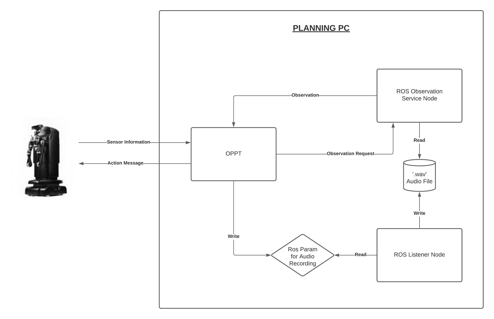

# AudioClassification

Clone the repo into a desired location. In this example we will use the local Desktop and install the module. 
## Installation:
    cd ~/Desktop
    git clone https://github.com/hoergems/AudioClassification.git
    mkdir Observation && cd Observation
    mkdir src
    ln -s ~/Desktop/AudioClassification/ObservationService ~/Desktop/Observation/src
    catkin_make
    cd ~/Desktop
    cd AudioClassification && mkdir build && cd build
    source ~/Desktop/Observation/devel/setup.bash
    cmake -DCMAKE_INSTALL_PREFIX=<install folder> -DUSE_ARM_HACK=ON ..
    make && make install

## Usage
On the MOVO2 computer, open a terminal and run

    movostop

Then run

    roslaunch movo_bringup_simple main.launch

On your computer, open 3 terminal windows. On the first window run the following commands : 

    source <install folder>/share/oppt/setup.sh
    source ~/Desktop/ObservationService/devel/setup.bash
    cd <oppt folder>/bin
    ./abt --cfg <folder where this repo is cloned into>/cfg/AudioClassification.cfg

On the second window run the following commands : 

    source <install folder>/share/oppt/setup.sh
    source ~/Desktop/ObservationService/devel/setup.bash
    rosrun ObservationService serviceNode.py

On the third window run the following commands : 

    source <install folder>/share/oppt/setup.sh
    source ~/Desktop/ObservationService/devel/setup.bash
    rosrun ObservationService listener.py

The robot used for the implementation of the model was Kinova Movo. The model uses OPPT for obtaining an optimal policy of the POMDP problem in real time. The block diagram in Figure above provides an idea regarding the architecture of the software model, and how information is exchanged between modules. There are 3 entities running on the planning PC : OPPT, observation service node and listener node. When OPPT decides that an observation generating action needs to be executed, it sets the value of a ROS param to be true. The listener node, which is repeatedly scanning the value of that param, starts recording the observation and when the param is set to false by OPPT, the recording stops and the audio file is saved to disk. Then, when OPPT requires the observation, a service request through ROS is sent to Observation service, which analyzes the saved audio signal and classifies the signal to its nearest cluster mean. OPPT is also linked to the robot via ethernet and ROS and transmits action messages to the robot and reads joint angle data periodically.

Python Speech Features module used for MFCC calculation is owned by James Lyons (https://github.com/jameslyons/python_speech_features).

ObservationService is a ros package that contains two ros nodes developed by Jihirshu Narayan. The first ROS node runs a listener module that is responsible for capturing and saving Observations when they are generated by the robot's interaction with the object. The second node runs an observation service that analyzes the captured observation, classifies it to one of the object classes defined by the observation model and returns the same as observation. The OPPT plugins were jointly created by Dr. Marcus Hoerger and Jihirshu Narayan and individual contribution is as follows : 
Initial Belief PLugin - Dr. Marcus Hoerger
Transition PLugin - Dr. Marcus Hoerger / Jihirshu Narayan
Observation Plugin - Jihirshu Narayan
Reward Plugin - Jihirshu Narayan
Terminal Plugin - Jihirshu Narayan
